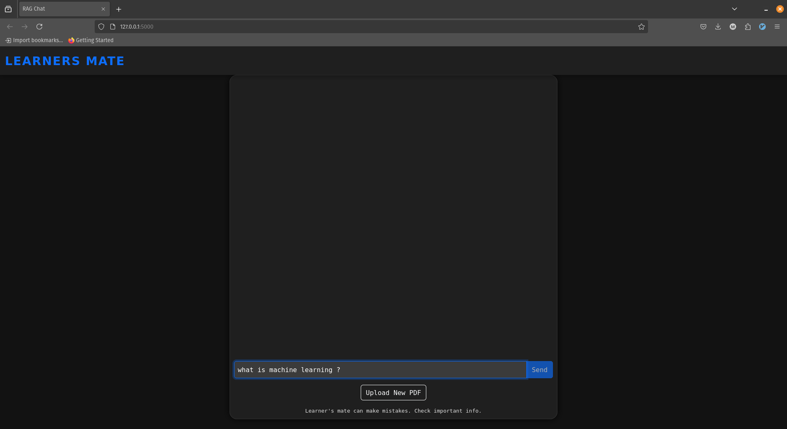
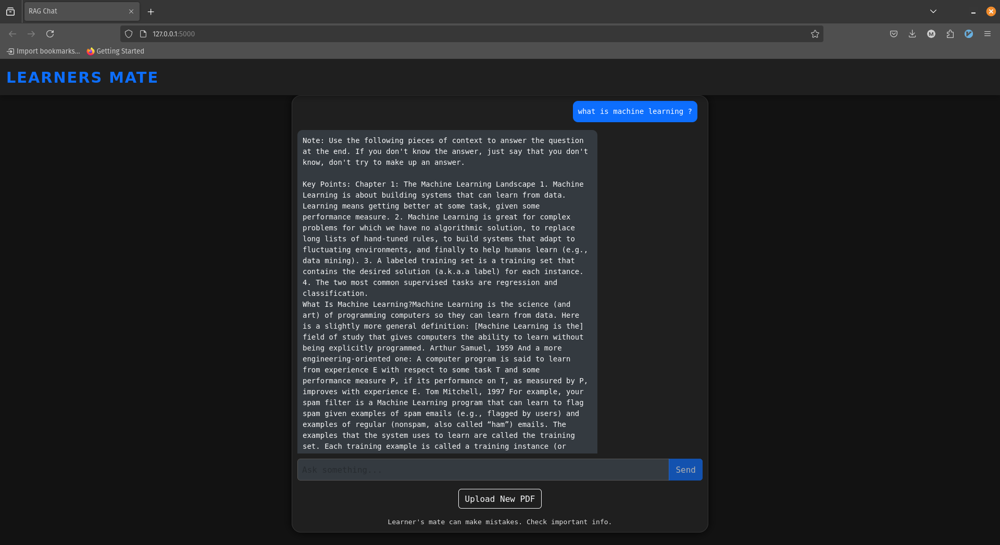
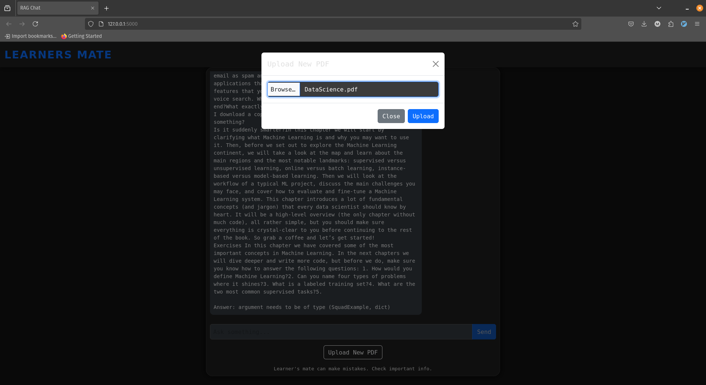
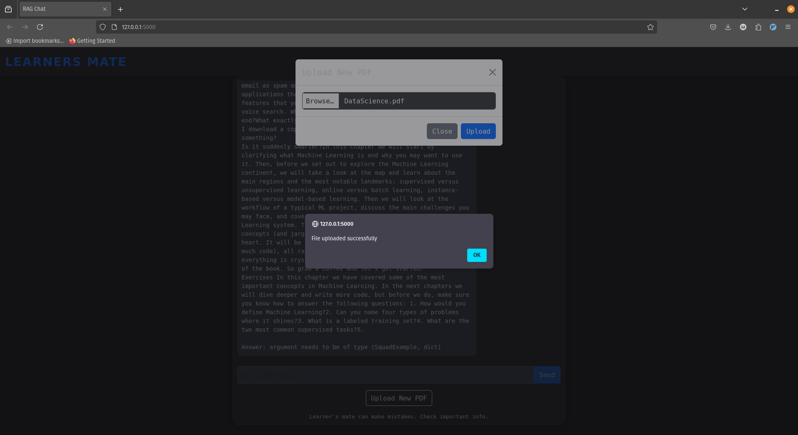
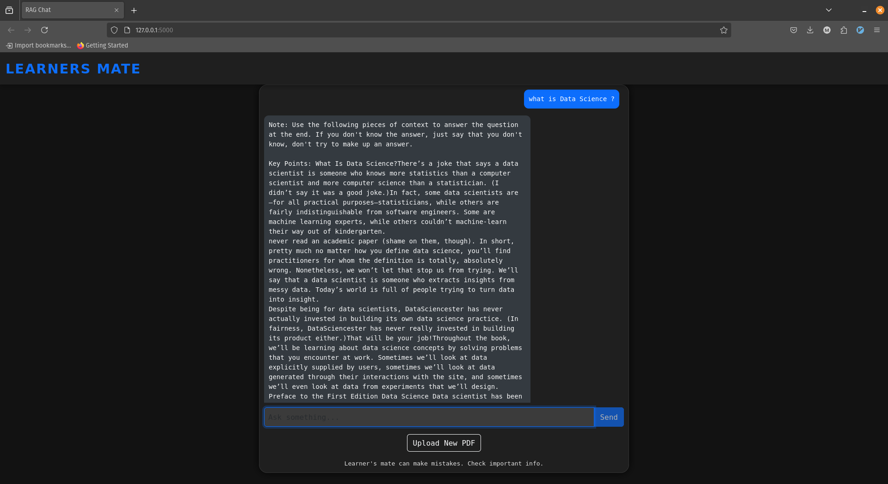

# Learners Mate: A Local Retrieval-Augmented-Generation(RAG) system

Learners Mate is a locally-hosted Retrieval-Augmented Generation (RAG) application designed to assist users in retrieving context-based answers from academic PDFs or text documents.
The system allows users to upload educational materials (PDFs), processes these into embeddings, and then uses a large language model to generate responses to user queries based on relevant document context.

# How the model works ?


# How it looks:

You can choose a default PDF to chat, in my case it's MachineLearning Textbook.



<ins>After uploading file, you need to wait for some minutes to convert PDF's content into Embeddings.</ins>


If file successfully uploads, this message will pop-up.



# Setup:

### NOTE: Tested in Python 3.10.12, running on Linux(Pop OS) with a NVIDIA GTX 1650

Minimum Requirements to use GPU is more than <b>4GB</b>.
If you've 4GB or below, then use CPU.

### <ins>Important Note: After uploading file, save LLM_Model.py and Restart Flask app</ins>.

## Clone Repo:

```bash
 git clone "repo_code"

```

```bash
cd "repo_dir"
```

Create a virtual environment and activate

```bash
source "_env/bin/activate"
```

Install the Dependencies

```bash
pip freeze > requirements.txt
pip install -r requirements.txt
```

Run model:

```bash
python LLM_Model.py
```

## If you enjoy using this project or find it helpful, don't forget to give it a ⭐️ to support its development!
