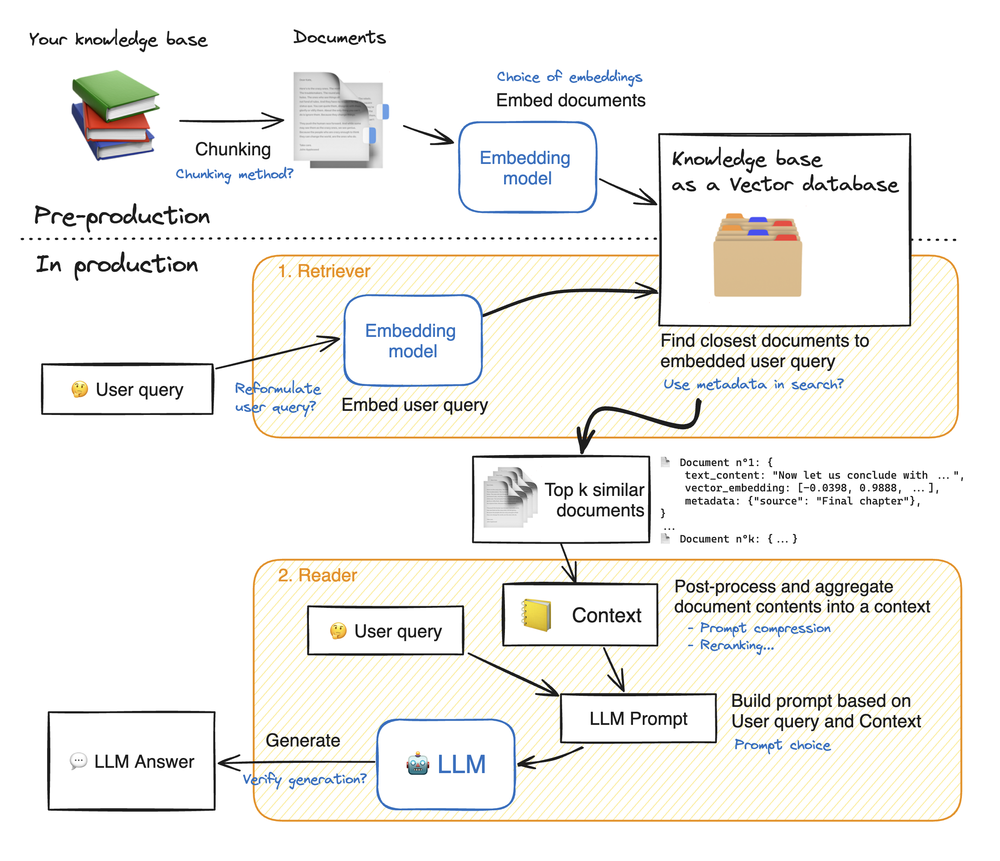

# Learners Mate: A Local Retrieval-Augmented-Generation(RAG) system

Learners Mate is a locally-hosted Retrieval-Augmented Generation (RAG) application designed to assist users in retrieving context-based answers from academic PDFs or text documents.
The system allows users to upload educational materials (PDFs), processes these into embeddings, and then uses a large language model to generate responses to user queries based on relevant document context.

# How the model works ?



## Background Process:


# Setup:

# NOTE: Tested in Python 3.10.12, running on Linux(Pop OS) with a NVIDIA GTX 1650

Minimum Requirements to run with GPU is more than 4GB
If you've 4GB or below then use CPU (little bit slower compare to GPU)

# Important Note: After uploading file, Restart Flask app.

## clone the Repo:

```bash
 git clone "repo_code"

```

```bash
cd "repo_dir"
```

create a virtual environment and activate

```bash
source "_env/bin/activate"
```

Install the Dependencies

```bash
pip freeze > requirements.txt
pip install -r requirements.txt
```

Final step:

```bash
python LLM_Model.py
```
